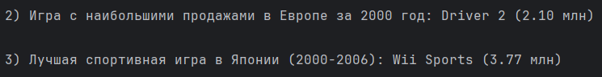
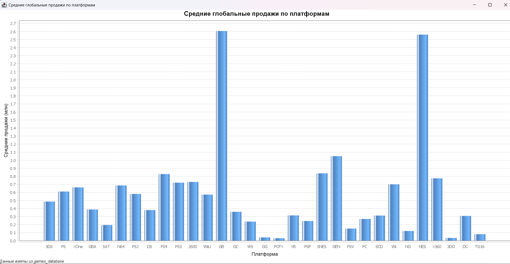

# UniversityJavaProject
Games.csv, 8 вариант

1) Классы для хранения и обработки данных:
   - `Main.java` - для запуска парсинга и задач
   - `Game.java` - для хранения данных об одной игре, используется для работы с данными из CSV-файла
   - `Parser.java` - для парсинга csv файла
   - `Database.java` - для работы с базой данных(создание таблицы, её очистка, заполнение и подключение)
   - `TaskQueries.java` - класс с sql-запросами для выполнения заданий
   - `Graph.java` - для построения графика

2) Порядок моих действий:
   - Распарсил `game.csv` и создал набор объектов `Game`.
   - Создал класс `Database.java` и написал в нем методы для подключения, создания таблицы, её очистки, заполнения данными.
   - Загрузил данные из набора объектов `Game` в Базу Данных(в файл `games_database.db`).
   - Создал класс `TaskQueries.java` и написал в нём sql-запросы для выполнения заданий:
      1) Средние глобальные продажи по платформам:
         ```
         SELECT platform, AVG(global_sales) AS avg_sales
         FROM games
         GROUP BY platform
         ORDER BY avg_sales DESC
      2) Игра с самым высоким показателем продаж в Европе:
         ```
         SELECT name, eu_sales
         FROM games
         WHERE year = 2000
         ORDER BY eu_sales DESC
         LIMIT 1
      3) Самая продаваемая спортивная игра в Японии (2000-2006):
         ```
         SELECT name, jp_sales
         FROM games
         WHERE year BETWEEN 2000 AND 2006 AND genre = 'Sports'
         ORDER BY jp_sales DESC
         LIMIT 1
   - Создал класс `Graph.java` для отрисовки графика.
   - Полученные данные вывел в консоль (Приложение 1).
   - Данные первого запроса визуализировал через класс `Graph.java` (Приложение 2).

# Приложение 1


# Приложение 2

